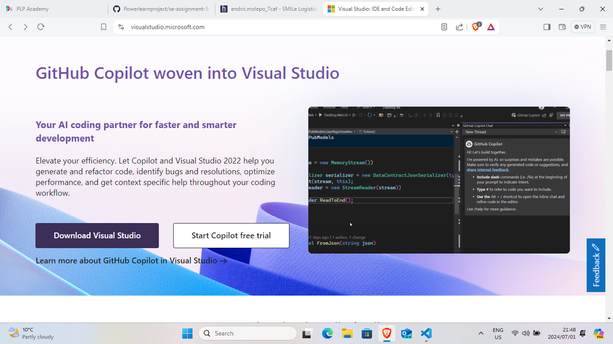
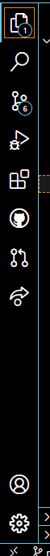
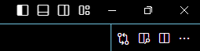

# SE-Assignment-5
Installation and Navigation of Visual Studio Code (VS Code)
 Instructions:
Answer the following questions based on your understanding of the installation and navigation of Visual Studio Code (VS Code). Provide detailed explanations and examples where appropriate.

 Questions:

1. Installation of VS Code:
   - Describe the steps to download and install Visual Studio Code on Windows 11 operating system. Include any prerequisites that might be needed.
Answer: Go to your favourite browser,then Search "Microsoft Visual studio",click on the first website.
A page will come up with the option to download visual studio, click on that and let the download begin
After promptly follow the installation wizard on setting up Visual studio code.
2. First-time Setup:
   - After installing VS Code, what initial configurations and settings should be adjusted for an optimal coding environment? Mention any important settings or extensions.
Font and Theme, are some of the intial configurations whether, Dark or light theme. Also deciding font size in settings. Prettier is an essential extension, coupled with Blackbox.ai,Python is also a key entension to install, depending on what programming langauge will be used.
3. User Interface Overview:
   - Explain the main components of the VS Code user interface. Identify and describe the purpose of the Activity Bar, Side Bar, Editor Group, and Status Bar.
The Activity Bar allows you to seamlessly switch between views.It can even track number of outgoing changes if Git is enabled. The Side bar is the primary bar that allows you to access the explorer, search,Source control and other tabs and extensions will show up.The editor group is the main are allowing the user to edit the files their working on. The Status Bar is the tab on which the developer gets information about the open project and the files being edited.
4. Command Palette:
   - What is the Command Palette in VS Code, and how can it be accessed? Provide examples of common tasks that can be performed using the Command Palette.
The Command Palette is the main tab allowing access to all commands. It can be accessed using the keyboard command "Ctrl+shift+P". It has multiple uses such as editor commands or opening new files.
5. Extensions in VS Code:
   - Discuss the role of extensions in VS Code. How can users find, install, and manage extensions? Provide examples of essential extensions for web development.
Users can find extensions under the Extension tab on the primary Side bars,They can search any extension with in the search bar. Then they can choose the extension from the list of extensions that could be possibly done. It would be best to download verified extensions that have been downloaded by many users, to keep safe. After downloading, the user can follow the relevant instructions on the extension page to enable and utilize the extension. Externsions such as Prettier, Blackbox.ai and Python can be essential for web developtment.  
6. Integrated Terminal:
   - Describe how to open and use the integrated terminal in VS Code. What are the advantages of using the integrated terminal compared to an external terminal?
To open the intergrated terminal, you can click on the toggle panel option on the top right of the screen. Then the Intergrated termial will open up, then depending whether to use Powershell or Gitbash, the user can change the Launch profile, depending on the work environment. Using the intergrated terminal makes it easier to do commands that the user may wish to execute. Problem with external terminals, may give an issue of compatability and user friendliness. 
7. File and Folder Management:
   - Explain how to create, open, and manage files and folders in VS Code. How can users navigate between different files and directories efficiently?
Under the Explorer tab under the Primary Side bar,If the user is already working in the desired folder. Then next to the title of the folder, there will be pop up options of creating new or opening files. Alternatively you can use the "Ctrl+Windows+N" keyboard shortcut to create a file. While "Ctrl+O" is the shortcut to open a file.
8. Settings and Preferences:
   - Where can users find and customize settings in VS Code? Provide examples of how to change the theme, font size, and keybindings.
Settings are found under the Settings tab located on the bottom of the Primary side bar.Then within settings, the user looks for the heading "Colour Theme",then under that tab they can select light/dark from a dropdown. Font size settings can be found under "Font Size" Then adjust font to users liking. While keybinding can be found under Keybidnings then navigate to the 'Keybindings.json' then change desired settings.
9. Debugging in VS Code:
   - Outline the steps to set up and start debugging a simple program in VS Code. What are some key debugging features available in VS Code?
Click on the Debugging icon in the Activity Bar on the side (or press Ctrl+Shift+D).
Click on the gear icon (create a launch.json file) or select a configuration from the dropdown and then click Add Configuration.Modify the launch.json file to specify how VS Code should launch and debug your program. You might set the program path, arguments, environment variables.Set breakpoints in your code by clicking in the gutter next to the line number where you want to pause execution.
Press F5 or click the green play button in the Debug sidebar to start debugging.
10. Using Source Control:
    - How can users integrate Git with VS Code for version control? Describe the process of initializing a repository, making commits, and pushing changes to GitHub.
They can simply ensure gitbash is installed and setup. Then you change directory into the desired file within the Gitbash the you initialize a repository then use the command "code ." to open Vs code with all the files and everything already opened. Once done with all the coding, use th "git add', 'git commit-m" with a message andf then git push to your github account.
 Submission Guidelines:
- Your answers should be well-structured, concise, and to the point.
- Provide screenshots or step-by-step instructions where applicable.
- Cite any references or sources you use in your answers.
- Submit your completed assignment by 1st July 

